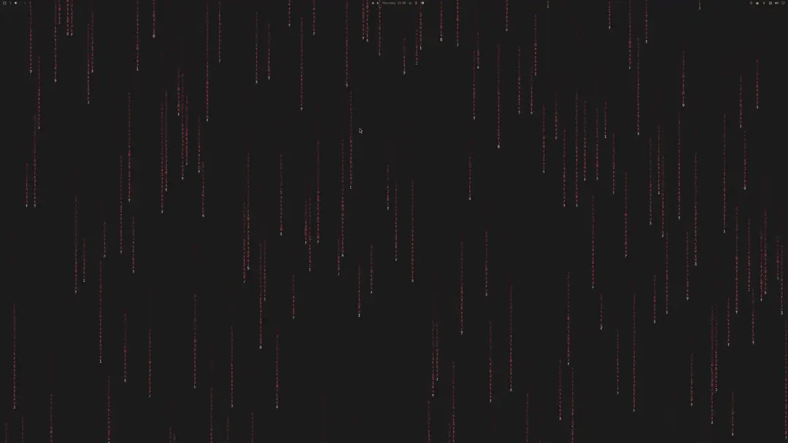
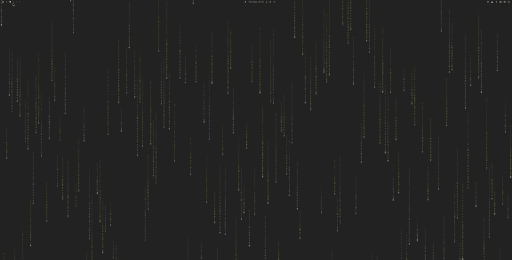

# Matrix Rain

A live, theme-coloured matrix rain wallpaper for [Omarchy](https://omarchy.org/)
— drawn natively in QML, not played back from a video file, so it recolours
itself the moment you switch themes.



Whole desktop, same thing running behind the bar:



It does **not** replace `omarchy.background`. The stock plugin keeps drawing
your wallpapers and keeps every upstream fix; this one claims the *bottom*
layer — above the wallpaper, below every window and the bar — and maps itself
only while the rain is your selected background. Select a normal wallpaper and
the surface is not mapped at all, so your desktop is bit-for-bit stock and this
plugin costs nothing.

## Install

```bash
omarchy plugin add https://github.com/nzkritik/omarchy-matrix-rain --enable --yes
```

Then turn the rain on:

```bash
omarchy-shell matrix-rain select
```

## Requirements

- Omarchy 4 with `omarchy-shell`
- ImageMagick — generates the picker entry

Both ship with Omarchy. `inotifywait` is used when present; without it the
plugin falls back to a one-second poll.

## Use

The rain appears as an entry in your normal background picker — double-click an
empty part of the desktop, or Menu → Style → Background — under **every** theme,
and it takes the theme's accent colour.

```bash
omarchy-shell matrix-rain select    # the rain
omarchy-shell matrix-rain status    # what is selected, from where, and idle/playing/paused
omarchy-shell matrix-rain lockState # whether the pause-while-locked wiring found the lock plugin
```

Any other wallpaper is drawn by the stock background plugin exactly as before.

### It stops while the session is locked

A session lock covers every layer-shell surface, so a locked screen hides this
wallpaper completely — and the lock screen blanks the display a few seconds
after that. Animating behind it is wasted work, so the rain freezes while the
session is locked (and while the lock *preview* is up) and resumes on a
successful unlock.

It freezes mid-fall and resumes from exactly where it stopped, rather than
restarting, so unlocking never shows the screen filling from the top. Measured
on a 4K display, the shell drops from roughly 9% CPU to none at all for as long
as the lock is up.

The lock plugin is found through the shell's service table, and a clone is
resolved by `resolveEnabledId`, so this keeps working if you customise the lock
screen. If no lock plugin is found the rain just keeps running —
`matrix-rain lockState` reports `attached` or `detached`.

### Rain *on* the lock screen

Making the lock screen itself draw rain — as opposed to pausing the wallpaper
behind it, above — is a separate plugin,
[Matrix Lock](https://github.com/nzkritik/omarchy-matrix-lock). It has to clone
and patch the built-in `omarchy.lock` plugin, which is a good deal more invasive
than a wallpaper, so it is kept out of this one — install it only if you want
it, and nothing here changes either way.

### Tuning the rain

Every knob is a `readonly property` at the top of `MatrixRain.qml` — glyph grid
pitch, fall speed range, trail lengths, how often glyphs mutate, and the
alphabet itself. Edit and run `omarchy restart shell`.

| Property | Default | What it does |
| --- | --- | --- |
| `cell` | 16 | Glyph grid pitch in px. Smaller is denser |
| `minSpeed` / `maxSpeed` | 2.5 / 8.0 | Fall speed range, in grid rows per second |
| `minTrail` / `maxTrail` | 14 / 48 | Glyphs per falling stream |
| `churnInterval` | 90 | ms between glyph mutations |
| `alphabet` | katakana + digits | The glyph set |

After changing the look, refresh the picker thumbnail so it matches: select the
rain, clear the screen or switch to an empty workspace, and run

```bash
~/.config/omarchy/plugins/nzkritik.matrix-rain/bin/omarchy-matrix-preview --capture
```

## How the rain gets into the picker

Omarchy's picker can only list still images, so the rain is represented by a
preview PNG named `zz-matrix-rain.png`, written into the **current theme's**
user background folder — a directory the stock picker already scans. Selecting
it symlinks that path like any wallpaper, and the plugin recognises the name and
draws the live effect instead of the still.

Nothing overrides a packaged command and there is no hook to install: the plugin
watches `~/.local/state/omarchy/current/theme.name` and re-tints the preview
itself when the theme changes. Files are created lazily, so only themes you
actually use get one.

Two consequences: `omarchy theme bg next` cycles through the rain along with
that theme's other backgrounds, and uninstalling leaves the preview files
behind — see below.

## Handling untrusted paths

`theme.name`, `colors.toml` and the background link are predictable paths any
process running as you can replace, so the preview script treats them as
untrusted in both directions.

- Every read goes through one bounded, no-follow, non-blocking helper, so a
  symlink is refused, a planted FIFO returns instead of wedging the process, and
  a swollen file cannot be pulled in whole.
- The theme name is validated before it is used as a path component, so it
  cannot walk the preview directory out of `~/.config/omarchy/backgrounds/`.
- Every write is staged in the destination directory, `fsync`ed, and committed
  with an atomic rename, after refusing any destination that is a symlink or not
  a regular file — so a link planted at the preview cannot redirect the write
  into another of your files, and an interrupted run cannot leave a half-written
  wallpaper behind.
- The shell service itself never opens any of these paths. It watches for change
  events by name and shells out to the script, so a hostile file can at worst
  stall a short-lived child, never the long-lived shell.

## Uninstall

```bash
omarchy plugin remove nzkritik.matrix-rain --yes
find ~/.config/omarchy/backgrounds -name zz-matrix-rain.png -delete
rm -rf ~/.local/state/omarchy-matrix-rain
```

## How it works

| File | Role |
| --- | --- |
| `Service.qml` | The bottom-layer overlay, the background watcher, preview upkeep, and the `matrix-rain` IPC target |
| `MatrixRain.qml` | The rain — falling glyph columns with a head/body/tail gradient off `Color.accent` |
| `bin/omarchy-matrix-preview` | Writes and tints the picker entry |

The overlay uses an empty input region (`mask: Region {}`), so clicks fall
straight through to the layer underneath and double-click-to-open-the-picker
keeps working. The renderer sits behind a `Loader` **source** rather than an
inline component, so nothing is instantiated while another wallpaper is
selected.

## Notes

- This is not Omarchy's screensaver behind your windows. `omarchy screensaver`
  runs `ttfx` in a terminal, and a terminal is an xdg-toplevel, which Hyprland
  can never stack below the background layer. The effect is reimplemented in QML
  here for that reason.

## Licence

MIT
